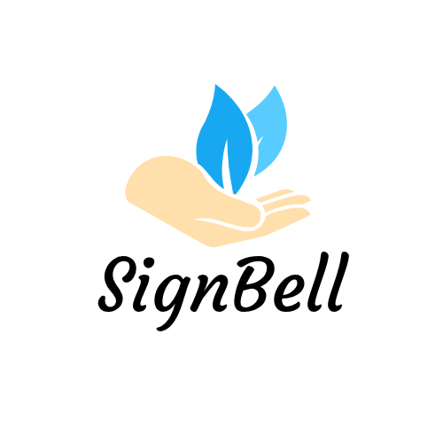
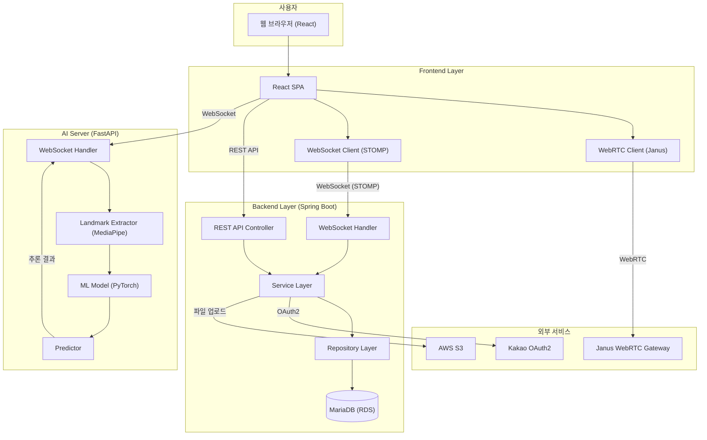

# SignBell : AI 기반 실시간 수어 학습 플랫폼

  

<b>SignBell - 수어 학습의 시작을 알리는 희망의 종소리</b>

AI 기술로 배우고, 게임으로 함께 즐기는 실시간 양방향 수어 학습 플랫폼

  <b>TEAM</b> SynergySign

---

## 목차

- [프로젝트 정보](#-프로젝트-정보)
- [Getting Started](#-getting-started)
- [프로젝트 비전](#-프로젝트-비전)
    - [이 프로젝트가 해결하는 문제](#-이-프로젝트가-해결하는-문제)
    - [프로젝트의 철학](#-프로젝트의-철학)
    - [플랫폼 차별성](#-플랫폼-차별성)
- [주요 기능](#-주요-기능)
- [사용자 페르소나](#-사용자-페르소나)
- [팀 구성](#-팀-구성)
- [개발 기간](#-개발-기간)
- [기술 스택](#-기술-스택)
- [시스템 아키텍처](#-시스템-아키텍처)
- [대표 문서](#-대표-문서)
    - [전체 문서 폴더](#-전체-문서-폴더)
    - [협업 규칙 & 기여 문서](#-협업-규칙--기여-문서)
- [향후 업데이트 계획](#-향후-업데이트-계획)
- [문의](#-문의)

---

##  프로젝트 정보

| 항목 | 내용 |
| --- | --- |
| **팀명** | **SynergySign** — *기술과 수어가 만나 시너지를 창출하고, 팀원 간의 협력을 통해 수어 소통의 새로운 가능성을 열어가는 팀* |
| **프로젝트명** | **SignBell** — *수어 학습의 시작을 알리고, 소통의 즐거움을 전파하는 희망의 종소리* |
| **플랫폼명** | **SignBell** — *Sign(수어) + Bell(종, 알림). 누구나 자연스럽고 안전하게 수어를 배우는 AI 기반 학습 플랫폼* |
| **버전** | v1.0.0 |
| **Base URL** | `http://localhost:8080/` (Backend), `http://localhost:5173` (Frontend), `https://localhost:8000` (FastAPI) |

---

##  Getting Started

- [백엔드 설치 및 실행 가이드](https://github.com/SynergySign/signbell-docs/blob/main/04_Guides/setup/Backend_Setup_Guide.md)
- [프론트엔드 설치 및 실행 가이드](https://github.com/SynergySign/signbell-docs/blob/main/04_Guides/setup/Frontend_Setup_Guide.md)
- [FastAPI 설치 및 실행 가이드](https://github.com/SynergySign/signbell-docs/blob/main/04_Guides/setup/FastAPI_Setup_Guide.md)
- [API 스펙 명세서](https://github.com/SynergySign/signbell-docs/blob/main/03_Specifications/SignBell_API_명세서.md)
- [시스템 아키텍처](https://github.com/SynergySign/signbell-docs/blob/main/02_Architecture/SignBell_시스템_아키텍처.md)

---

##  프로젝트 비전

SignBell은 단순한 수어 교육 앱이 아니라, **대화 불안을 해결하고 청인과 농인 사이의 소통 장벽을 허무는 AI 기반 학습 플랫폼**입니다.

### SignBell이 해결하는 문제

- **대화 시작의 어려움**: 수어 통역사가 없는 상황에서 농인과의 소통에 어려움을 겪으며 깊은 대화를 나누지 못하는 안타까움
- **학습 피드백 부재**: 온라인 강의를 보며 수어를 따라 해보지만, 정확한 피드백이 없어 학습에 한계를 느끼는 답답함
- **학습 동기 부족**: 단순 암기 위주의 학습 방식에 쉽게 지루함을 느끼고 중도에 포기하게 되는 경험

### SignBell의 철학

* **AI 기반 개인화 학습**:
  사용자의 수어 동작을 실시간으로 분석하여 정확도를 피드백해주는 '거울 모드'를 통해 혼자서도 효과적으로 학습할 수 있습니다.

* **게이미피케이션을 통한 즐거움**:
  WebRTC 기반의 실시간 영상통화 방에서 다른 학습자들과 함께 퀴즈를 풀며 경쟁하고 소통하는 재미를 제공합니다.

* **데이터 기반 성장**:
  사용자의 학습 데이터(동의 시)를 통해 AI 모델이 스스로 성능을 개선하는 선순환 구조를 만듭니다.

* **포용적 사회 기여**:
  누구나 차별 없이 소통할 수 있는 사회를 만드는 데 기여하는 소셜 임팩트를 창출합니다.

### 플랫폼 차별성

SignBell의 목표는 "수어가 소수만의 언어가 아닌, 누구나 쉽게 배울 수 있는 또 하나의 언어"로 만드는 것입니다.

| 구분 | 기존 수어 학습 앱 | **SignBell** |
| --- | --- | --- |
| **핵심 경험** | 일방향 영상 시청 | **AI 피드백 + 실시간 퀴즈 대결** |
| **AI 역할**| 없음 또는 단순 번역 | **실시간 동작 분석 + 정확도 피드백 + 개인화 학습** |
| **학습 방식** | 혼자 반복 학습 | **개인 학습 + 멀티플레이 퀴즈** |
| **피드백** | 없음 | **실시간 AI 피드백 및 유사도 점수** |
| **사용자 경험** | 지루한 암기 | **게임처럼 즐기는 학습** |

> SignBell은 수어 학습을 넘어, **기술을 통해 마음과 마음이 통하는 세상**을 만드는 데 집중합니다.

---

##  주요 기능

### 개인 수어 학습 (거울 모드)
- **AI 기반 실시간 피드백**: MediaPipe를 활용한 손/얼굴/포즈 랜드마크 추출 및 CNN+BiLSTM+Attention 모델을 통한 수어 동작 인식
- **정확도 분석**: 사용자의 수어 동작과 정답 동작의 유사도를 실시간으로 계산하여 점수 제공
- **학습 콘텐츠 관리**: 수어 단어 목록 조회, 카테고리별 분류, 키워드 검색 기능
- **학습 데이터 제공**: 사용자 동의 기반 학습용 수어 영상 데이터 수집 및 AI 모델 개선에 기여

### 실시간 수어 퀴즈 게임
- **WebRTC 화상 통신**: Janus Gateway를 활용한 실시간 4인 멀티플레이 화상 퀴즈
- **게임 진행 시스템**: 턴 기반 도전자 시스템, 준비/사인 타이머, 실시간 점수 집계
- **게임방 관리**: 방 생성/입장/퇴장, 무한 스크롤 방 목록, 방장 권한 관리
- **WebSocket 실시간 동기화**: STOMP 프로토콜 기반 게임 상태 실시간 브로드캐스트

### 인증 및 사용자 관리
- **카카오 소셜 로그인**: OAuth2 기반 간편 로그인 및 JWT 토큰 발급
- **마이페이지**: 프로필 이미지 업로드(S3 연동), 닉네임 변경, 학습 기록 조회
- **약관 동의**: 필수/선택 약관 동의 관리 및 개인정보 보호

---

## 사용자 페르소나

### 주요 타겟

| 페르소나 | 연령/직업 | 주요 니즈 | 사용 시나리오 |
| --- | --- | --- | --- |
| **문화 공감형 학습자** | 26세, 대학생 | 쉽고 재미있게 수어를 배우고 싶음 | AI 피드백으로 정확도 확인, 거울 모드로 시각적 비교 |
| **소통 실천형 학습자** | 32세, 직장인 | 농인 동료와 원활한 소통 | 실용 수어 습득, 실시간 퀴즈로 반복 학습 |
| **전문 성장형 학습자** | 28세, 사회복지사 | 업무에서 정확한 수어 사용 | 실시간 피드백 기반 학습, 진도 관리 |
| **경쟁·협력형 학습자** | 21세, 대학생 | 친구들과 즐기며 수어 배우기 | WebRTC 실시간 퀴즈 대결, 랭킹 시스템 |

---

## 팀 구성

| 역할 | 이름 | 주요 담당 기능 | GitHub |
| --- | --- | --- | --- |
| 팀장 | [신동준](https://github.com/sdj3959) | Frontend Lead, UI/UX 디자인, 인프라 구축 (AWS EC2/S3/RDS, Kubernetes) | [@sdj3959](https://github.com/sdj3959) |
| 팀원 | [고동현](https://github.com/rhehdgus8831) | Backend Lead (게임 로직), WebRTC 연동, 시스템 아키텍처 설계 | [@rhehdgus8831](https://github.com/rhehdgus8831) |
| 팀원 | [백승현](https://github.com/sirosho) | AI/ML Lead, FastAPI 서버 구축, 개인 학습 페이지 개발 | [@sirosho](https://github.com/sirosho) |
| 팀원 | [송민재](https://github.com/songkey06) | Backend (인증/인가), 카카오 SSO, 마이페이지, DevOps 지원 | [@songkey06](https://github.com/songkey06) |
| 팀원 | [강관주](https://github.com/Kanggwanju) | Full-Stack (대기방/게임방), 무한 스크롤, 전역 예외 처리 | [@Kanggwanju](https://github.com/Kanggwanju) |

---

##  개발 기간

**2025.10.07 ~ 2025.10.28**

| **Phase** | **기간** | **주요 내용** |
| --- | --- | --- |
| **Phase 1. Planning** | 10.07 ~ 10.09 | 기획, 요구사항 정의, 사용자 페르소나, DB 모델링, 시스템 아키텍처 설계 |
| **Phase 2. ML Development** | 10.10 ~ 10.18 | AI 모델 개발, 데이터 수집 및 전처리, 학습 및 평가, FastAPI 서버 구축 |
| **Phase 3. Backend Development** | 10.12 ~ 10.22 | Spring Boot 백엔드 개발, WebSocket 구현, 게임 로직, 인증/인가 |
| **Phase 4. Frontend Development** | 10.15 ~ 10.25 | React 프론트엔드 개발, WebRTC 연동, UI/UX 구현, API 통합 |
| **Phase 5. Integration & Deploy** | 10.23 ~ 10.28 | 통합 테스트, 버그 수정, AWS 배포, 문서 정리, 최종 발표 준비 |

---

##  기술 스택

| 구분 | 기술 |
| --- | --- |
| **언어** |    |
| **프레임워크** |    |
| **프론트엔드** |    |
| **상태 관리** |  |
| **라우팅** |  |
| **HTTP 클라이언트** |  |
| **보안/인증** |    |
| **AI/ML** |    |
| **데이터베이스** |    |
| **실시간 통신** |   |
| **환경 변수** |  |
| **빌드/의존성** |   |
| **테스트** |   |
| **인프라** |     |
| **CI/CD** |    |
| **협업 도구** |    |
| **개발 환경** |    |

---

##  시스템 아키텍처

### 전체 아키텍처 개요

### 주요 데이터 흐름

1. **개인 수어 학습 (거울 모드)**
    - 사용자가 웹캠으로 수어 동작 수행
    - React에서 MediaStream을 FastAPI 서버로 WebSocket 전송
    - MediaPipe로 랜드마크 추출 (147차원 특징 벡터)
    - PyTorch 모델로 수어 동작 인식 및 유사도 계산
    - 실시간 피드백 및 점수를 클라이언트로 반환

2. **실시간 수어 퀴즈 게임**
    - 사용자가 게임방 생성/입장
    - Janus Gateway를 통한 4인 WebRTC 화상 연결
    - Spring Boot WebSocket으로 게임 상태 실시간 동기화
    - 도전자가 수어 동작 수행 시 FastAPI로 전송하여 정답 판정
    - 점수 집계 및 게임 결과를 MariaDB에 저장

-----

##  대표 문서

### 기획 및 요구사항
- [프로젝트 개요](https://github.com/SynergySign/signbell-docs/blob/main/01_Planning/SignBell_프로젝트%20개요.md)
- [기획 배경 및 동기](https://github.com/SynergySign/signbell-docs/blob/main/01_Planning/SignBell_기획%20배경%20및%20동기.md)
- [사용자 페르소나](https://github.com/SynergySign/signbell-docs/blob/main/01_Planning/SignBell_사용자%20페르소나.md)
- [역할분담 명세서](https://github.com/SynergySign/signbell-docs/blob/main/01_Planning/SignBell_역할분담%20명세서.md)

### 시스템 설계 및 명세
- [시스템 아키텍처](https://github.com/SynergySign/signbell-docs/blob/main/02_Architecture/SignBell_시스템_아키텍처.md)
- [기술 스택](https://github.com/SynergySign/signbell-docs/blob/main/02_Architecture/SignBell_기술%20스택.md)
- [개념 ERD 명세서](https://github.com/SynergySign/signbell-docs/blob/main/02_Architecture/SignBell_개념_ERD_명세서.md)
- [논리 ERD 명세서](https://github.com/SynergySign/signbell-docs/blob/main/02_Architecture/SignBell_논리_ERD_명세서.md)
- [API 명세서 (REST)](https://github.com/SynergySign/signbell-docs/blob/main/03_Specifications/SignBell_API_명세서.md)
- [WebSocket API 명세서](https://github.com/SynergySign/signbell-docs/blob/main/03_Specifications/SignBell_실시간_수어_퀴즈_WebSocket_API_명세서.md)
- [기능 요구사항 명세서](https://github.com/SynergySign/signbell-docs/blob/main/03_Specifications/SignBell_기능_요구사항_명세서.md)

### 개발 가이드
- [백엔드 설치 및 실행 가이드](https://github.com/SynergySign/signbell-docs/blob/main/04_Guides/setup/Backend_Setup_Guide.md)
- [프론트엔드 설치 및 실행 가이드](https://github.com/SynergySign/signbell-docs/blob/main/04_Guides/setup/Frontend_Setup_Guide.md)
- [FastAPI 설치 및 실행 가이드](https://github.com/SynergySign/signbell-docs/blob/main/04_Guides/setup/FastAPI_Setup_Guide.md)
- [수어인식 서버 기술 명세서](https://github.com/SynergySign/signbell-docs/blob/main/04_Guides/technical/수어인식_서버_기술_명세서.md)
- [클라이언트-수어인식 파이프라인](https://github.com/SynergySign/signbell-docs/blob/main/04_Guides/technical/클라이언트_수어인식_파이프라인.md)

### 정책 및 약관
- [서비스 이용약관](https://github.com/SynergySign/signbell-docs/blob/main/05_Policies/SignBell_서비스_이용약관.md)
- [개인정보처리방침](https://github.com/SynergySign/signbell-docs/blob/main/05_Policies/SignBell_개인정보처리방침.md)

### 전체 문서 폴더
- [01_Planning](https://github.com/SynergySign/signbell-docs/tree/main/01_Planning) - 프로젝트 기획 문서
- [02_Architecture](https://github.com/SynergySign/signbell-docs/tree/main/02_Architecture) - 시스템 아키텍처 및 설계 문서
- [03_Specifications](https://github.com/SynergySign/signbell-docs/tree/main/03_Specifications) - 프로젝트 세부 스펙 문서
- [04_Guides](https://github.com/SynergySign/signbell-docs/tree/main/04_Guides) - 프로젝트 내부 규칙 및 개발 가이드
- [05_Policies](https://github.com/SynergySign/signbell-docs/tree/main/05_Policies) - 프로젝트 정책 관련 문서
- [06_meeting-notes](https://github.com/SynergySign/signbell-docs/tree/main/06_meeting-notes) - 프로젝트 회의록
- [assets](https://github.com/SynergySign/signbell-docs/tree/main/assets) - 이미지, 다이어그램

### 협업 규칙 & 기여 문서
- [문서 버전 관리 규칙](https://github.com/SynergySign/signbell-docs/blob/main/04_Guides/collaboration/doc-versioning-rules.md)
- [Git 워크플로우 규칙](https://github.com/SynergySign/signbell-docs/blob/main/04_Guides/collaboration/git-workflow.md)

-----

##  향후 업데이트 계획

### Phase 1 (v1.1.0) — AI 모델 고도화 및 UX 개선

* **AI 모델 성능 향상**
    * 더 많은 수어 단어 데이터셋 확보 및 학습
    * 모델 경량화를 통한 추론 속도 개선
    * 실시간 피드백 정확도 향상

* **사용자 경험 개선**
    * 학습 진도 추적 및 통계 대시보드
    * 오답 노트 및 복습 기능
    * 다크 모드 지원

### Phase 2 (v1.2.0) — 소셜 기능 및 콘텐츠 확장

* **소셜 기능**
    * 친구 추가 및 학습 기록 공유
    * 리더보드 및 랭킹 시스템
    * 팀 대항전 모드

* **콘텐츠 확장**
    * 문장 단위 수어 학습
    * 상황별 수어 회화 학습
    * 수어 스토리텔링 콘텐츠

### Phase 3 (v2.0.0) — 멀티 플랫폼 및 글로벌 확장

* **멀티 플랫폼**
    * 모바일 앱 (iOS/Android)
    * 태블릿 최적화
    * PWA 지원

* **글로벌 확장**
    * 다국어 수어 지원 (ASL, BSL 등)
    * 다국어 UI/UX
    * 글로벌 커뮤니티 구축

---

##  문의

> 궁금한 점은 언제든 GitHub Issue를 통해 문의 바랍니다.

**문의:** GitHub Issues 또는 Pull Request

**프로젝트 관리:** [Team SynergySign](https://github.com/SynergySign)

**레포지토리:**
- [signbell-app](https://github.com/SynergySign/signbell-app) - Frontend & Backend
- [signbell-docs](https://github.com/SynergySign/signbell-docs) - 프로젝트 문서
- [signbell-fastapi](https://github.com/SynergySign/signbell-fastapi) - AI 추론 서버
- [signbell-ml](https://github.com/SynergySign/signbell-ml) - ML 모델 개발